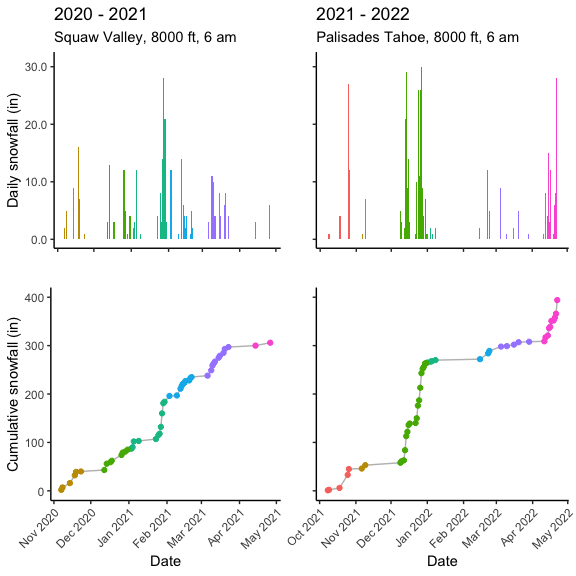

    library(tidyverse)

    ## ── Attaching packages ─────────────────────────────────────── tidyverse 1.3.1 ──

    ## ✓ ggplot2 3.3.5     ✓ purrr   0.3.4
    ## ✓ tibble  3.1.6     ✓ dplyr   1.0.7
    ## ✓ tidyr   1.1.4     ✓ stringr 1.4.0
    ## ✓ readr   2.1.1     ✓ forcats 0.5.1

    ## ── Conflicts ────────────────────────────────────────── tidyverse_conflicts() ──
    ## x dplyr::filter() masks stats::filter()
    ## x dplyr::lag()    masks stats::lag()

    library(cowplot)
    library(magick)

    ## Linking to ImageMagick 6.9.12.3
    ## Enabled features: cairo, fontconfig, freetype, heic, lcms, pango, raw, rsvg, webp
    ## Disabled features: fftw, ghostscript, x11

    library(lubridate)

    ## 
    ## Attaching package: 'lubridate'

    ## The following object is masked from 'package:cowplot':
    ## 
    ##     stamp

    ## The following objects are masked from 'package:base':
    ## 
    ##     date, intersect, setdiff, union

    library(scales)

    ## 
    ## Attaching package: 'scales'

    ## The following object is masked from 'package:purrr':
    ## 
    ##     discard

    ## The following object is masked from 'package:readr':
    ## 
    ##     col_factor

    CITY = "Olympic Valley, CA"

    weather <- read_csv("../data/weather-2022-04-25.csv") %>% 
      mutate(CITY = CITY) %>%
      mutate(MONTH = month(DATE),
             DAY = day(DATE),
             YEAR = year(DATE)) %>%
      select(DATE, MONTH:YEAR, CITY,  PRCP, SNWD)  %>%
      arrange(desc(DATE))  %>%
      mutate(PRE = lag(SNWD, default = NA),
             DIFF = PRE - SNWD ) 

    head(weather)

    weather %>%
      filter(YEAR > 2002,
             MONTH %in% c(3,4)) %>%
      ggplot(aes(x = DATE, y = PRCP, color = as.factor(YEAR))) +
      geom_point() +
      theme(legend.position = "none")

    weather %>%
      filter(YEAR %in% c(2020,2021,2022)) %>%
      ggplot(aes(x = DATE, y = SNWD, color = SNWD)) +
      geom_point() 

    weather %>%
      group_by(YEAR, MONTH) %>%
      summarize(PRCP_A = mean(PRCP)) %>%
      drop_na() %>%
      filter(MONTH == 4) %>%
      ggplot(aes(x = YEAR, y = PRCP_A, fill = PRCP_A)) +
      geom_bar(stat = "identity") +
      labs(subtitle = "Average snowfall in April", 
           y = "Precitation, units?") 

    weather %>%
      group_by(YEAR, MONTH) %>%
      summarize(SNWD_M = max(SNWD)) %>%
      drop_na() %>%
      filter(MONTH == 4) %>%
      ggplot(aes(x = YEAR, y = SNWD_M, fill = SNWD_M)) +
      geom_bar(stat = "identity") +
      labs(subtitle = "Average snowfall in April", 
           y = "Precitation, units?") 

    weather %>%
      select(-PRCP) %>%
      filter(DATE != "2022-04-12",
             YEAR > 2002,
             MONTH %in% c(3,4)) %>%
      ggplot(aes(x = DATE, y = DIFF, color = as.factor(MONTH))) +
      geom_line() +
      labs(subtitle = "Daily snowfall", 
           y = "Snowfall, in?")  + 
      facet_wrap(~YEAR, scales = "free_x", nrow = 1) +
      theme(axis.text.x = element_text(angle = 90),
            legend.position = "bottom") +
      scale_x_date(breaks = "month", date_labels = "%m")

    palisades <- read.csv("../data/2021_2022_snowfall.csv")  %>%
      mutate(Date = as.Date(As.of.6am,format='%A, %B %d' )) %>%
      separate(As.of.6am, into = c("DayofWeek", "Date2"), sep = ", ") %>%
      separate(Date2, into = c("Month", "Day")) %>%
      select(Date, everything())  %>%
      mutate(Date = as.character(Date)) %>%
      mutate(Date = ifelse(grepl("October|November|December", Month), gsub("2022", "2021", Date), Date)) %>%
      mutate(Month = factor(Month, levels = c("October", "November", "December",
                                              "January", "February", "March", "April"))) %>%
      mutate(Date = as.Date(Date)) 

    hourly <- palisades$Palisades.Tahoe.8000..24.hour
    cumulative <- palisades$Palisades.Tahoe.8000..Cumulative

    a <- ggplot(palisades, aes(x = Date, y = hourly, label = hourly, fill = Month)) +
      geom_bar(stat = "identity") +
      theme_classic() +
      theme(axis.text.x = element_blank(),
            axis.text.y = element_blank(),
            legend.position = "none") +
      scale_x_date(breaks = "month", date_labels = "%b %Y") +
      labs(title = "2021 - 2022",
        subtitle = "Palisades Tahoe, 8000 ft, 6 am",
           y = " ", x  = NULL) +
      scale_y_continuous( labels = label_number(accuracy = 0.1), limits = c(0,31.0)) 

    b <- ggplot(palisades, aes(x = Date, y = cumulative, label = cumulative, color = Month)) +
      geom_line(color = "grey") +
      geom_point() +
      theme_classic() +
      theme(axis.text.x = element_text(angle = 45, hjust = 1),
                    axis.text.y = element_blank()) +
      theme(legend.position =  "none") +
      scale_x_date(breaks = "month", date_labels = "%b %Y")  +
      labs(subtitle = " ",
           y = " ")   +
      ylim(0,400)
     

    ab <- plot_grid(a,b , ncol = 1, rel_heights = c(0.45,0.55))

    ##

    palisades2020 <- read.csv("../data/2020_2021_snowfall.csv")  %>%
      mutate(Date = as.Date(As.of.6am,format='%A, %B %d' )) %>%
      separate(As.of.6am, into = c("DayofWeek", "Date2"), sep = ", ") %>%
      separate(Date2, into = c("Month", "Day")) %>%
      select(Date, everything())  %>%
      mutate(Date = as.character(Date)) %>%
      mutate(Date = ifelse(grepl("October|November|December", Month), gsub("2022", "2020", Date), gsub("2022", "2021", Date))) %>%
      mutate(Month = factor(Month, levels = c("October", "November", "December",
                                              "January", "February", "March", "April"))) %>%
      mutate(Date = as.Date(Date)) 

    ## Warning: Expected 2 pieces. Additional pieces discarded in 48 rows [1, 2, 3, 4,
    ## 5, 6, 7, 8, 9, 10, 11, 12, 13, 14, 15, 16, 17, 18, 19, 20, ...].

    ## Warning: Expected 2 pieces. Missing pieces filled with `NA` in 1 rows [36].

    hourly <- palisades2020$X8.000..24.hour
    cumulative <- palisades2020$X8.000..Cumulative

    c <- ggplot(palisades2020, aes(x = Date, y = hourly, label = hourly, fill = Month)) +
      geom_bar(stat = "identity") +
      theme_classic() +
      theme(axis.text.x = element_blank(),
            legend.position = "none") +
      scale_x_date(breaks = "month", date_labels = "%b %Y") +
      labs(title = "2020 - 2021",
           subtitle = "Squaw Valley, 8000 ft, 6 am",
           y = "Daily snowfall (in)", x  = NULL) +
      scale_y_continuous(
      labels = label_number(accuracy = 0.1)) +
      scale_fill_manual(values = c("#C49A00", "#53B400" ,"#00C094", 
                                    "#00B6EB", "#A58AFF", "#FB61D7")) +
     
      scale_y_continuous( labels = label_number(accuracy = 0.1), limits = c(0,31.0)) 

    ## Scale for 'y' is already present. Adding another scale for 'y', which will
    ## replace the existing scale.

    d <- ggplot(palisades2020, aes(x = Date, y = cumulative, label = cumulative, color = Month)) +
      geom_line(color = "grey") +
      geom_point() +
      theme_classic() +
      theme(axis.text.x = element_text(angle = 45, hjust = 1)) +
      theme(legend.position =  "none") +
      scale_x_date(breaks = "month", date_labels = "%b %Y")  +
      labs(subtitle = " ",
           y = "Cumulative snowfall (in)") +
      scale_color_manual(values = c("#C49A00", "#53B400" ,"#00C094", 
                                    "#00B6EB", "#A58AFF", "#FB61D7")) +
      ylim(0,400)

    cd <- plot_grid(c,d , ncol = 1, rel_heights = c(0.45,0.55))

    ## Warning: Removed 1 rows containing missing values (position_stack).

    ## Warning: Removed 1 row(s) containing missing values (geom_path).

    ## Warning: Removed 1 rows containing missing values (geom_point).

    plot_grid(cd, ab)

