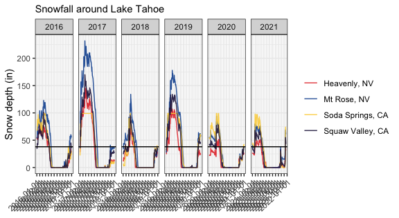
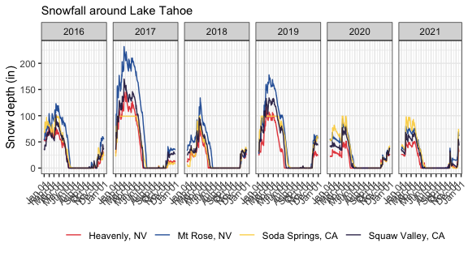

## Weather - ggridges

    knitr::opts_chunk$set(echo = T, message = T, 
                          results = T, warning = T,
                          fig.path = '../images/')

    library(tidyverse)

    ## ── Attaching packages ─────────────────────────────────────── tidyverse 1.3.1 ──

    ## ✓ ggplot2 3.3.5     ✓ purrr   0.3.4
    ## ✓ tibble  3.1.5     ✓ dplyr   1.0.7
    ## ✓ tidyr   1.1.4     ✓ stringr 1.4.0
    ## ✓ readr   2.0.2     ✓ forcats 0.5.1

    ## ── Conflicts ────────────────────────────────────────── tidyverse_conflicts() ──
    ## x dplyr::filter() masks stats::filter()
    ## x dplyr::lag()    masks stats::lag()

    library(lubridate)

    ## 
    ## Attaching package: 'lubridate'

    ## The following objects are masked from 'package:base':
    ## 
    ##     date, intersect, setdiff, union

    library(cowplot)

    ## 
    ## Attaching package: 'cowplot'

    ## The following object is masked from 'package:lubridate':
    ## 
    ##     stamp

    library(viridis)

    ## Loading required package: viridisLite

    library(scales)

    ## 
    ## Attaching package: 'scales'

    ## The following object is masked from 'package:viridis':
    ## 
    ##     viridis_pal

    ## The following object is masked from 'package:purrr':
    ## 
    ##     discard

    ## The following object is masked from 'package:readr':
    ## 
    ##     col_factor

    library(ggridges)

    nov11 <- read_csv("../data/weather-2021-11-11.csv") %>%
      select(STATION, NAME, DATE, SNWD) %>%
      mutate(NAME = factor(NAME),
             STATION = factor(STATION))   %>% 
      mutate(DATE2 = DATE) %>%
      separate(DATE2, c("YEAR", "MONTH", "DAY"))  

    ## Rows: 1571 Columns: 13

    ## ── Column specification ────────────────────────────────────────────────────────
    ## Delimiter: ","
    ## chr   (2): STATION, NAME
    ## dbl  (10): AWND, PRCP, SNOW, SNWD, TAVG, TMAX, TMIN, TOBS, WESD, WSFI
    ## date  (1): DATE

    ## 
    ## ℹ Use `spec()` to retrieve the full column specification for this data.
    ## ℹ Specify the column types or set `show_col_types = FALSE` to quiet this message.

    summary(nov11)

    ##         STATION                             NAME          DATE           
    ##  US1CAPC0001:359   HEAVENLY VALLEY, CA US     :404   Min.   :2020-10-01  
    ##  USS0019K07S:404   MOUNT ROSE SKI AREA, NV US :404   1st Qu.:2021-01-07  
    ##  USS0019L24S:404   SODA SPRINGS 1.5 SSW, CA US:359   Median :2021-04-15  
    ##  USS0020K30S:404   SQUAW VALLEY G.C., CA US   :404   Mean   :2021-04-16  
    ##                                                      3rd Qu.:2021-07-22  
    ##                                                      Max.   :2021-11-08  
    ##                                                                          
    ##       SNWD           YEAR              MONTH               DAY           
    ##  Min.   : 0.00   Length:1571        Length:1571        Length:1571       
    ##  1st Qu.: 0.00   Class :character   Class :character   Class :character  
    ##  Median : 6.00   Mode  :character   Mode  :character   Mode  :character  
    ##  Mean   :19.84                                                           
    ##  3rd Qu.:36.00                                                           
    ##  Max.   :98.00                                                           
    ##  NA's   :50

    # rename levels
    levels(nov11$NAME) 

    ## [1] "HEAVENLY VALLEY, CA US"      "MOUNT ROSE SKI AREA, NV US" 
    ## [3] "SODA SPRINGS 1.5 SSW, CA US" "SQUAW VALLEY G.C., CA US"

    levels(nov11$NAME) <- c("Heavenly, NV",  
                            "Mt Rose, NV",  
                            "Soda Springs, CA",
                            "Squaw Valley, CA")
    levels(nov11$NAME) 

    ## [1] "Heavenly, NV"     "Mt Rose, NV"      "Soda Springs, CA" "Squaw Valley, CA"

    skicolors <- c("#e53735",  "#11539f", "#fbd249",  "#231a49" )

    p <- nov11 %>% 
      ggplot(aes(x = DATE, y = SNWD, color = NAME)) +
        #geom_point(size = 0.1, alpha = 0.5) +
        geom_line(alpha = 0.9) +
        labs(x = NULL, y = "Snow depth (in)",
             subtitle = "Snowfall around Lake Tahoe",
             color = NULL) +
        theme_bw() +
        theme(#legend.position = "none",
              axis.text.x = element_text(angle = 45, 
                                         hjust = 1)) +
      scale_color_manual(values = skicolors) +
      scale_x_date(breaks = date_breaks("month")) + 
      facet_grid(~YEAR, drop = T, 
                 scales = "free_x", space = "free_x") +
      geom_hline(yintercept = 38)
    p

    ## Warning: Removed 3 row(s) containing missing values (geom_path).

    jpeg(file="../images/weather-ggridges-1.jpg", width=1600, height=800, res = 300)
    p

    ## Warning: Removed 3 row(s) containing missing values (geom_path).

    dev.off()

    ## quartz_off_screen 
    ##                 2

    p2 <- nov11 %>% 
      ggplot(aes(x = DATE, y = SNWD, color = NAME)) +
        #geom_point(size = 0.1, alpha = 0.5) +
        geom_line(alpha = 0.9) +
        labs(x = NULL, y = "Snow depth (in)",
             subtitle = "Snowfall around Lake Tahoe",
             color = NULL) +
        theme_bw() +
        theme(legend.position = "bottom",
              axis.text.x = element_text(angle = 45, 
                                         hjust = 1)) +
      scale_color_manual(values = skicolors) +
      scale_x_date(breaks = date_breaks("month"),
                   labels = date_format("%b %d")) + 
      facet_grid(~YEAR, drop = T, 
                 scales = "free_x", space = "free_x") 
    p2

    ## Warning: Removed 3 row(s) containing missing values (geom_path).

    jpeg(file="../images/weather-ggridges-2.jpg", width=1650, height=1650, res = 300)
    p2

    ## Warning: Removed 3 row(s) containing missing values (geom_path).

    dev.off()

    ## quartz_off_screen 
    ##                 2

    p3 <- ggplot(nov11, aes(x = DATE, y = NAME, 
                            height = SNWD, fill = NAME)) +
      geom_density_ridges(stat = "identity", alpha = 0.75, scale = 4) +
      scale_fill_manual(values = skicolors) +
      theme_cowplot() +
      theme(legend.position = "none",
            axis.text.x = element_text(angle = 45, 
                                         hjust = 1)) +
      scale_x_date(breaks = date_breaks("month"), 
                   labels = date_format("%b %d %Y")) +
      labs(subtitle = "Snow Depth around Lake Tahoe, Oct 2020 - Nov 2021",
           y = NULL,
           caption = "Daily summaries collected from https://www.ncdc.noaa.gov/cdo-web/search",
          x =  NULL) 
    p3

    jpeg(file="../images/weather-ggridges-3.jpg", width=1600, height=1200, res = 300)
    p3
    dev.off()

    ## quartz_off_screen 
    ##                 2
