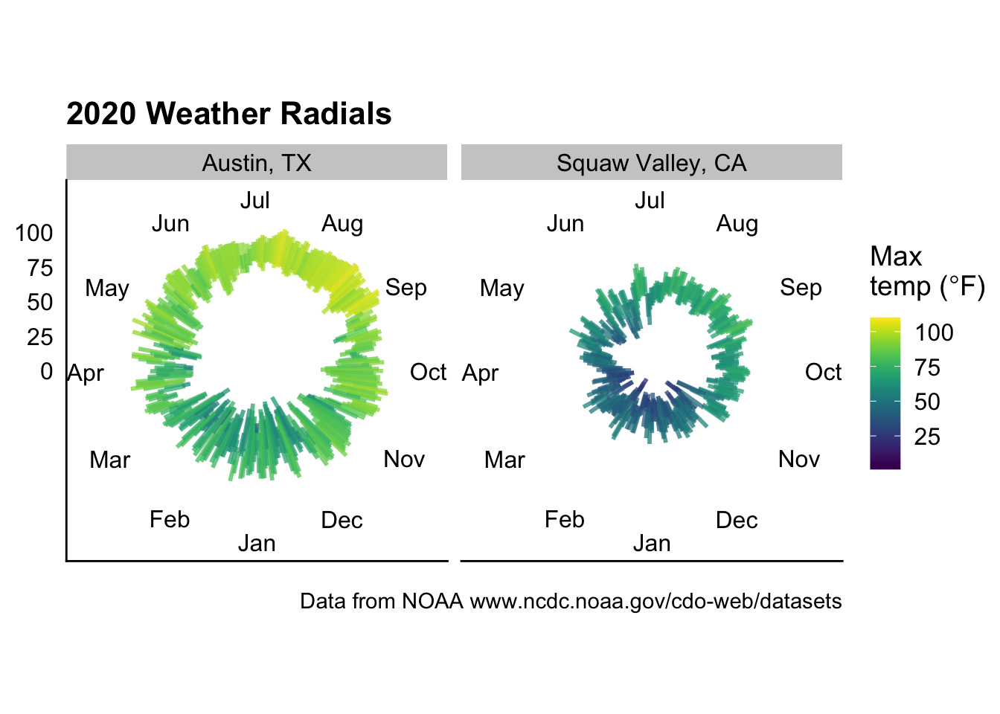
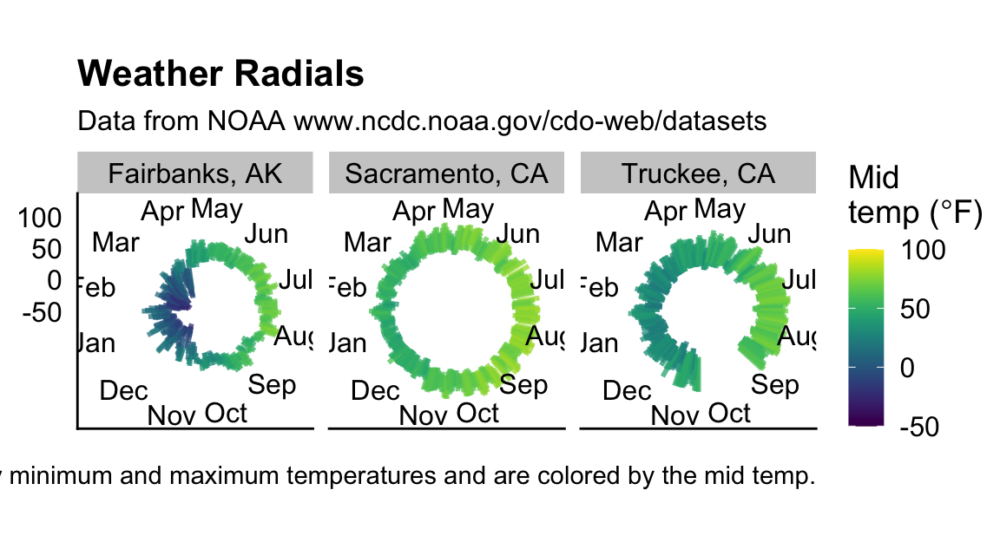
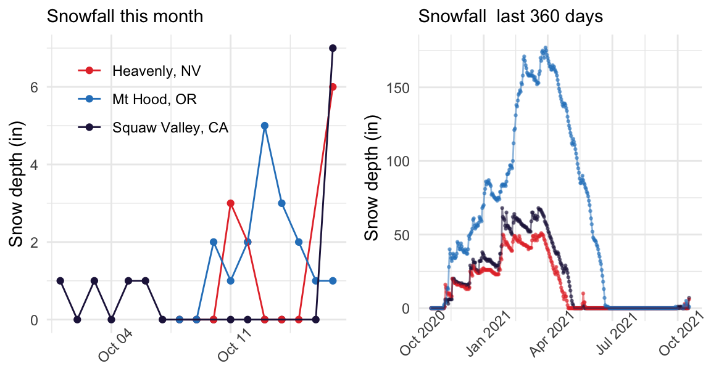
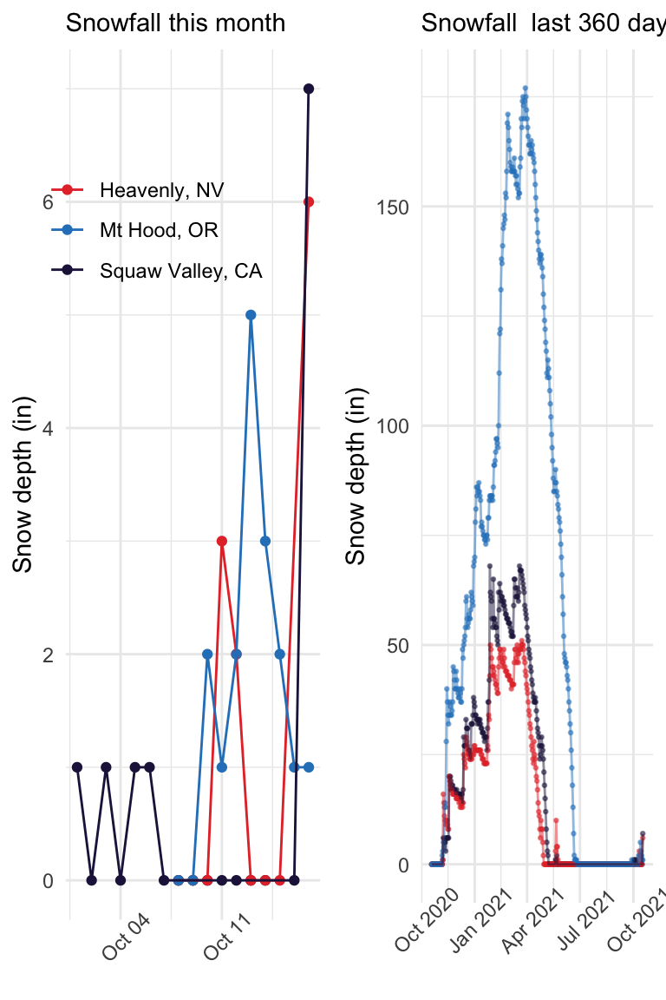
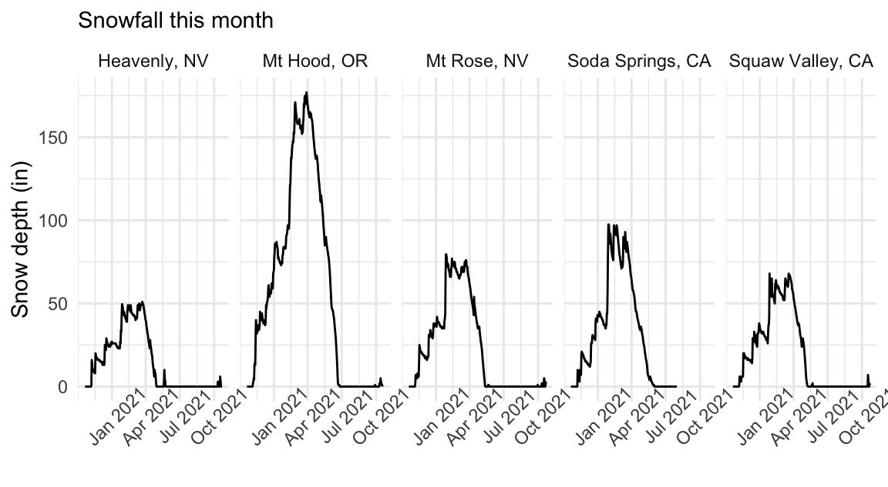
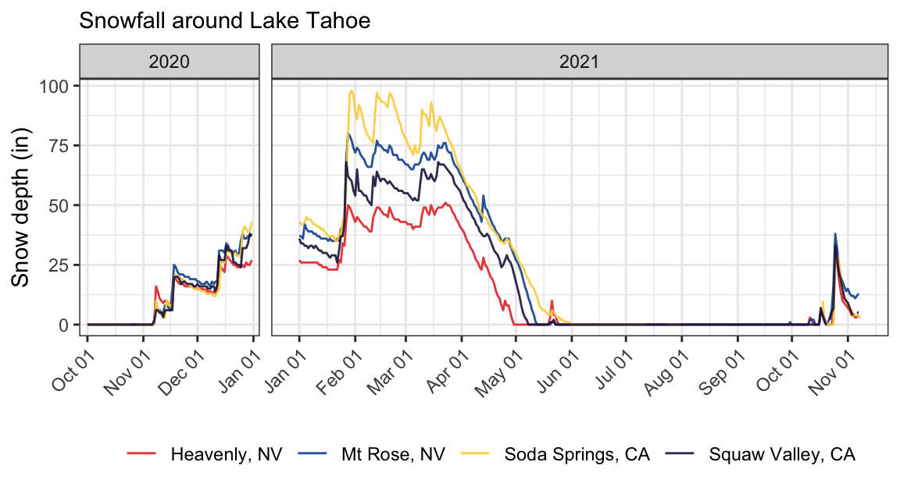
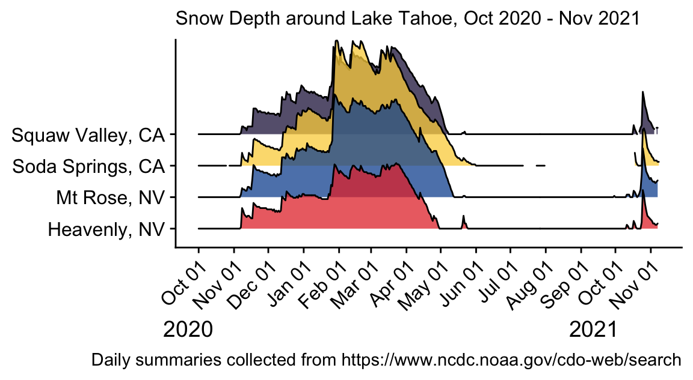
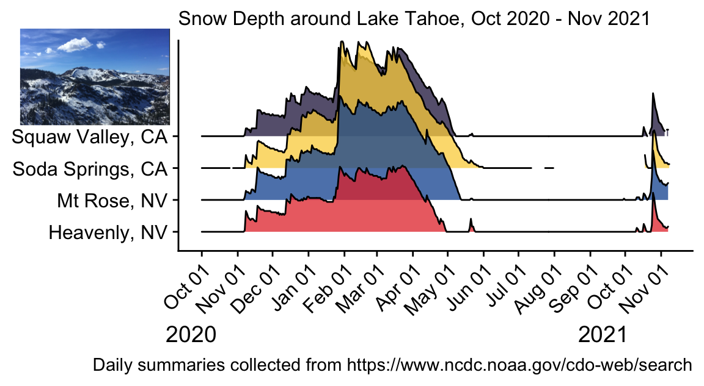

    knitr::opts_chunk$set(echo = T, message = T, 
                          results = T, warning = T,
                          fig.path = '../images/')

    library(tidyverse)

    ## ── Attaching packages ─────────────────────────────────────── tidyverse 1.3.1 ──

    ## ✓ ggplot2 3.3.5     ✓ purrr   0.3.4
    ## ✓ tibble  3.1.5     ✓ dplyr   1.0.7
    ## ✓ tidyr   1.1.4     ✓ stringr 1.4.0
    ## ✓ readr   2.0.2     ✓ forcats 0.5.1

    ## ── Conflicts ────────────────────────────────────────── tidyverse_conflicts() ──
    ## x dplyr::filter() masks stats::filter()
    ## x dplyr::lag()    masks stats::lag()

    library(lubridate)

    ## 
    ## Attaching package: 'lubridate'

    ## The following objects are masked from 'package:base':
    ## 
    ##     date, intersect, setdiff, union

    library(cowplot)

    ## 
    ## Attaching package: 'cowplot'

    ## The following object is masked from 'package:lubridate':
    ## 
    ##     stamp

    library(magick)

    ## Linking to ImageMagick 6.9.12.3
    ## Enabled features: cairo, fontconfig, freetype, heic, lcms, pango, raw, rsvg, webp
    ## Disabled features: fftw, ghostscript, x11

    #library(hablar)
    library(viridis)

    ## Loading required package: viridisLite

    library(scales)

    ## 
    ## Attaching package: 'scales'

    ## The following object is masked from 'package:viridis':
    ## 
    ##     viridis_pal

    ## The following object is masked from 'package:purrr':
    ## 
    ##     discard

    ## The following object is masked from 'package:readr':
    ## 
    ##     col_factor

    library(ggridges)
    library(magick)
        

    noaa <- image_read("../images/noaa.png")
    photo_file <- image_read( "../images/photo-tahoe.png")

## Austin Versus Squaw ~ March 2021

    weather <- read_csv("../data/weather.csv") %>%
      mutate(date = DATE) %>% 
      select(date, NAME, TAVG, TMAX, TMIN) %>%
      mutate(city = "Squaw Valley, CA")

    ## Rows: 444 Columns: 12

    ## ── Column specification ────────────────────────────────────────────────────────
    ## Delimiter: ","
    ## chr  (2): STATION, NAME
    ## dbl  (9): AWND, PRCP, SNWD, TAVG, TMAX, TMIN, TOBS, WESD, WSFI
    ## date (1): DATE

    ## 
    ## ℹ Use `spec()` to retrieve the full column specification for this data.
    ## ℹ Specify the column types or set `show_col_types = FALSE` to quiet this message.

    head(weather)

    ## # A tibble: 6 × 6
    ##   date       NAME                      TAVG  TMAX  TMIN city            
    ##   <date>     <chr>                    <dbl> <dbl> <dbl> <chr>           
    ## 1 2020-01-01 SQUAW VALLEY G.C., CA US    36    45    28 Squaw Valley, CA
    ## 2 2020-01-02 SQUAW VALLEY G.C., CA US    34    43    27 Squaw Valley, CA
    ## 3 2020-01-03 SQUAW VALLEY G.C., CA US    41    53    33 Squaw Valley, CA
    ## 4 2020-01-04 SQUAW VALLEY G.C., CA US    32    38    27 Squaw Valley, CA
    ## 5 2020-01-05 SQUAW VALLEY G.C., CA US    27    31    23 Squaw Valley, CA
    ## 6 2020-01-06 SQUAW VALLEY G.C., CA US    36    49    27 Squaw Valley, CA

    weather4 <- read_csv("../data/weather4.csv") %>%
      mutate(date = DATE) %>% 
      select(date, NAME, TAVG, TMAX, TMIN) %>%
      mutate(city = "Austin, TX")

    ## Rows: 445 Columns: 23

    ## ── Column specification ────────────────────────────────────────────────────────
    ## Delimiter: ","
    ## chr   (2): STATION, NAME
    ## dbl  (20): AWND, PGTM, PRCP, SNOW, SNWD, TAVG, TMAX, TMIN, WDF2, WDF5, WSF2,...
    ## date  (1): DATE

    ## 
    ## ℹ Use `spec()` to retrieve the full column specification for this data.
    ## ℹ Specify the column types or set `show_col_types = FALSE` to quiet this message.

    head(weather4)

    ## # A tibble: 6 × 6
    ##   date       NAME                                     TAVG  TMAX  TMIN city     
    ##   <date>     <chr>                                   <dbl> <dbl> <dbl> <chr>    
    ## 1 2020-01-01 AUSTIN BERGSTROM INTERNATIONAL AIRPORT…    54    58    50 Austin, …
    ## 2 2020-01-02 AUSTIN BERGSTROM INTERNATIONAL AIRPORT…    55    61    41 Austin, …
    ## 3 2020-01-03 AUSTIN BERGSTROM INTERNATIONAL AIRPORT…    53    66    39 Austin, …
    ## 4 2020-01-04 AUSTIN BERGSTROM INTERNATIONAL AIRPORT…    54    73    33 Austin, …
    ## 5 2020-01-05 AUSTIN BERGSTROM INTERNATIONAL AIRPORT…    55    75    35 Austin, …
    ## 6 2020-01-06 AUSTIN BERGSTROM INTERNATIONAL AIRPORT…    54    76    34 Austin, …

    weather <- rbind(weather, weather4) %>%
        filter(date <= as.Date("2020-12-31"))

    ggplot(weather, aes(date, ymin = TMIN, ymax = TMAX, color = TMAX)) +
      geom_linerange(size = 1, alpha = 0.75) +
      scale_color_viridis(discrete = F, limits = c(1,110)) +
      scale_x_date(labels = date_format("%b"), breaks = date_breaks("month")) +
      ylim(0, 110) +
      labs(
        title = "2020 Weather Radials",
        x = NULL,
        y = NULL,
        color = expression(paste("Max\ntemp (",degree,"F)")) ,
        caption = "Data from NOAA www.ncdc.noaa.gov/cdo-web/datasets"
      ) +
      coord_polar(start = 3.14) +
      theme_cowplot() +
      theme(legend.position = "right",
            axis.ticks.y = element_blank()) +
      facet_wrap(~city)

## Davis, Truckee, and Fairbanks

    dtf <- read_csv("../data/weather-2021-10-21.csv") %>%
      select(STATION, NAME, DATE, TMIN, TMAX, TAVG) %>%
      mutate(TMID = ((TMIN + TMAX)/2),
             NAME = factor(NAME),
             STATION = factor(STATION))  

    ## Rows: 1045 Columns: 25

    ## ── Column specification ────────────────────────────────────────────────────────
    ## Delimiter: ","
    ## chr   (2): STATION, NAME
    ## dbl  (22): LATITUDE, LONGITUDE, ELEVATION, AWND, PRCP, SNOW, SNWD, TAVG, TMA...
    ## date  (1): DATE

    ## 
    ## ℹ Use `spec()` to retrieve the full column specification for this data.
    ## ℹ Specify the column types or set `show_col_types = FALSE` to quiet this message.

    head(dtf)

    ## # A tibble: 6 × 7
    ##   STATION     NAME                            DATE        TMIN  TMAX  TAVG  TMID
    ##   <fct>       <fct>                           <date>     <dbl> <dbl> <dbl> <dbl>
    ## 1 USW00026411 FAIRBANKS INTERNATIONAL AIRPOR… 2020-10-19    18    22    20  20  
    ## 2 USW00026411 FAIRBANKS INTERNATIONAL AIRPOR… 2020-10-20     6    23    18  14.5
    ## 3 USW00026411 FAIRBANKS INTERNATIONAL AIRPOR… 2020-10-21    23    27    24  25  
    ## 4 USW00026411 FAIRBANKS INTERNATIONAL AIRPOR… 2020-10-22     1    27    22  14  
    ## 5 USW00026411 FAIRBANKS INTERNATIONAL AIRPOR… 2020-10-23    -1    21     8  10  
    ## 6 USW00026411 FAIRBANKS INTERNATIONAL AIRPOR… 2020-10-24     8    27    17  17.5

    tail(dtf)

    ## # A tibble: 6 × 7
    ##   STATION     NAME                         DATE        TMIN  TMAX  TAVG  TMID
    ##   <fct>       <fct>                        <date>     <dbl> <dbl> <dbl> <dbl>
    ## 1 USC00049040 TRUCKEE TAHOE AIRPORT, CA US 2021-08-26    32    78    NA  55  
    ## 2 USC00049040 TRUCKEE TAHOE AIRPORT, CA US 2021-08-27    32    85    NA  58.5
    ## 3 USC00049040 TRUCKEE TAHOE AIRPORT, CA US 2021-08-28    35    87    NA  61  
    ## 4 USC00049040 TRUCKEE TAHOE AIRPORT, CA US 2021-08-29    38    87    NA  62.5
    ## 5 USC00049040 TRUCKEE TAHOE AIRPORT, CA US 2021-08-30    37    90    NA  63.5
    ## 6 USC00049040 TRUCKEE TAHOE AIRPORT, CA US 2021-08-31    37    87    NA  62

    summary(dtf)

    ##         STATION                                        NAME    
    ##  USC00049040:315   FAIRBANKS INTERNATIONAL AIRPORT, AK US:365  
    ##  USW00023232:365   SACRAMENTO AIRPORT ASOS, CA US        :365  
    ##  USW00026411:365   TRUCKEE TAHOE AIRPORT, CA US          :315  
    ##                                                                
    ##                                                                
    ##                                                                
    ##                                                                
    ##       DATE                 TMIN             TMAX             TAVG      
    ##  Min.   :2020-10-19   Min.   :-42.00   Min.   :-14.00   Min.   :-29.0  
    ##  1st Qu.:2021-01-14   1st Qu.: 16.00   1st Qu.: 44.00   1st Qu.: 31.0  
    ##  Median :2021-04-11   Median : 37.00   Median : 64.00   Median : 52.0  
    ##  Mean   :2021-04-11   Mean   : 30.56   Mean   : 59.17   Mean   : 44.8  
    ##  3rd Qu.:2021-07-07   3rd Qu.: 48.25   3rd Qu.: 80.00   3rd Qu.: 65.0  
    ##  Max.   :2021-10-18   Max.   : 69.00   Max.   :109.00   Max.   : 88.0  
    ##                       NA's   :9        NA's   :9        NA's   :315    
    ##       TMID       
    ##  Min.   :-27.00  
    ##  1st Qu.: 30.50  
    ##  Median : 50.50  
    ##  Mean   : 44.87  
    ##  3rd Qu.: 63.50  
    ##  Max.   : 87.50  
    ##  NA's   :9

    # rename levels
    levels(dtf$NAME) 

    ## [1] "FAIRBANKS INTERNATIONAL AIRPORT, AK US"
    ## [2] "SACRAMENTO AIRPORT ASOS, CA US"        
    ## [3] "TRUCKEE TAHOE AIRPORT, CA US"

    levels(dtf$NAME) <- c("Fairbanks, AK", "Sacramento, CA", "Truckee, CA")

    ggplot(dtf, aes(x = DATE, ymin = TMIN, ymax = TMAX, color = TMID)) +
      geom_linerange(size = 1, alpha = 0.75) +
      scale_color_viridis(discrete = F, limits = c(-50,100)) +
      scale_x_date(labels = date_format("%b"), breaks = date_breaks("month")) +
      ylim(-50,100) +
      labs(
        title = "Weather Radials",
        caption = "The lines connect the daily minimum and maximum temperatures and are colored by the mid temp.",
        x = NULL,
        y = NULL,
        color = expression(paste("Mid\ntemp (",degree,"F)")) ,
        subtitle = "Data from NOAA www.ncdc.noaa.gov/cdo-web/datasets"
      ) +
      coord_polar(start = 3.14) +
      theme_cowplot() +
      theme(legend.position = "right",
           # axis.text.y = element_blank(), 
            axis.ticks.y = element_blank()) +
      facet_wrap(~NAME)

    ## Warning: Removed 3 rows containing missing values (geom_segment).

    ## Warning: Removed 16 rows containing missing values (geom_segment).

    ## Warning: Removed 4 rows containing missing values (geom_segment).

## Squaw, Heavenly, Vail, Mt Hood

    df <- read_csv("../data/weather-2021-10-22.csv") %>%
      select(STATION, NAME, DATE, SNWD) %>%
      filter(!grepl("VAIL", NAME)) %>%
      mutate(NAME = factor(NAME),
             STATION = factor(STATION)) %>%
      drop_na()

    ## Rows: 1460 Columns: 15

    ## ── Column specification ────────────────────────────────────────────────────────
    ## Delimiter: ","
    ## chr   (2): STATION, NAME
    ## dbl  (12): LATITUDE, LONGITUDE, ELEVATION, AWND, PRCP, SNWD, TAVG, TMAX, TMI...
    ## date  (1): DATE

    ## 
    ## ℹ Use `spec()` to retrieve the full column specification for this data.
    ## ℹ Specify the column types or set `show_col_types = FALSE` to quiet this message.

    summary(df)

    ##         STATION                             NAME          DATE           
    ##  USS0019L24S:355   HEAVENLY VALLEY, CA US     :355   Min.   :2020-10-19  
    ##  USS0020K30S:363   MOUNT HOOD TEST SITE, OR US:357   1st Qu.:2021-01-16  
    ##  USS0021D08S:357   SQUAW VALLEY G.C., CA US   :363   Median :2021-04-16  
    ##                                                      Mean   :2021-04-15  
    ##                                                      3rd Qu.:2021-07-14  
    ##                                                      Max.   :2021-10-17  
    ##       SNWD       
    ##  Min.   :  0.00  
    ##  1st Qu.:  0.00  
    ##  Median : 14.00  
    ##  Mean   : 31.22  
    ##  3rd Qu.: 47.00  
    ##  Max.   :177.00

    # rename levels
    levels(df$NAME) 

    ## [1] "HEAVENLY VALLEY, CA US"      "MOUNT HOOD TEST SITE, OR US"
    ## [3] "SQUAW VALLEY G.C., CA US"

    levels(df$NAME) <- c("Heavenly, NV", "Mt Hood, OR", "Squaw Valley, CA")
    levels(df$NAME) 

    ## [1] "Heavenly, NV"     "Mt Hood, OR"      "Squaw Valley, CA"

    skicolors <- c("#e53735", "#2a82c4", "#231a49" )

    a <- df %>%
      filter(DATE >= as.Date("2021-10-01")) %>%
      ggplot(aes(x = DATE, y = SNWD, color = NAME)) +
        geom_point() +
        geom_line() +
        labs(x = NULL, y = "Snow depth (in)",
             subtitle = "Snowfall this month",
             color = NULL) +
        theme_minimal() +
        theme(legend.position = c(0.35, 0.8),
              axis.text.x = element_text(angle = 45)) +
      scale_color_manual(values = skicolors)

    b <- df %>%
      ggplot(aes(x = DATE, y = SNWD, color = NAME)) +
        geom_point(size = 0.5, alpha = 0.5) +
        geom_line(alpha = 0.5) +
        labs(x = NULL, y = "Snow depth (in)",
             subtitle = "Snowfall  last 360 days",
             #caption = "Data from NOAA www.ncdc.noaa.gov/cdo-web/datasets",
             color = NULL) +
        theme_minimal() +
        theme(legend.position = "none",
              axis.text.x = element_text(angle = 45))  +
      scale_color_manual(values = skicolors)

    plot_grid(a,b, nrow = 1)

    plot_grid(a,b, nrow = 1)

## October 25

    oct25 <- read_csv("../data/weather-2021-10-25.csv") %>%
      select(STATION, NAME, DATE, SNWD) %>%
      filter(!grepl("VAIL", NAME)) %>%
      mutate(NAME = factor(NAME),
             STATION = factor(STATION)) %>%
      drop_na()

    ## Rows: 1752 Columns: 26

    ## ── Column specification ────────────────────────────────────────────────────────
    ## Delimiter: ","
    ## chr  (12): STATION, NAME, AWND_ATTRIBUTES, PRCP_ATTRIBUTES, SNOW_ATTRIBUTES,...
    ## dbl  (13): LATITUDE, LONGITUDE, ELEVATION, AWND, PRCP, SNOW, SNWD, TAVG, TMA...
    ## date  (1): DATE

    ## 
    ## ℹ Use `spec()` to retrieve the full column specification for this data.
    ## ℹ Specify the column types or set `show_col_types = FALSE` to quiet this message.

    summary(oct25)

    ##         STATION                             NAME          DATE           
    ##  US1CAPC0001:271   HEAVENLY VALLEY, CA US     :367   Min.   :2020-10-21  
    ##  USS0019K07S:367   MOUNT HOOD TEST SITE, OR US:363   1st Qu.:2021-01-16  
    ##  USS0019L24S:367   MOUNT ROSE SKI AREA, NV US :367   Median :2021-04-12  
    ##  USS0020K30S:366   SODA SPRINGS 1.5 SSW, CA US:271   Mean   :2021-04-14  
    ##  USS0021D08S:363   SQUAW VALLEY G.C., CA US   :366   3rd Qu.:2021-07-08  
    ##                                                      Max.   :2021-10-22  
    ##       SNWD       
    ##  Min.   :  0.00  
    ##  1st Qu.:  0.00  
    ##  Median : 14.00  
    ##  Mean   : 29.37  
    ##  3rd Qu.: 46.00  
    ##  Max.   :177.00

    # rename levels
    levels(oct25$NAME) 

    ## [1] "HEAVENLY VALLEY, CA US"      "MOUNT HOOD TEST SITE, OR US"
    ## [3] "MOUNT ROSE SKI AREA, NV US"  "SODA SPRINGS 1.5 SSW, CA US"
    ## [5] "SQUAW VALLEY G.C., CA US"

    levels(oct25$NAME) <- c("Heavenly, NV", "Mt Hood, OR", 
                            "Mt Rose, NV", "Soda Springs, CA",  "Squaw Valley, CA")
    levels(oct25$NAME) 

    ## [1] "Heavenly, NV"     "Mt Hood, OR"      "Mt Rose, NV"      "Soda Springs, CA"
    ## [5] "Squaw Valley, CA"

    skicolors <- c("#e53735", "#2a82c4", "#11539f", "#2b7496", "#231a49" )

    oct25 %>%
      ggplot(aes(x = DATE, y = SNWD)) +
        #geom_point(size = 0.5) +
        geom_line() +
        labs(x = NULL, y = "Snow depth (in)",
             subtitle = "Snowfall this month",
             color = NULL) +
        theme_minimal() +
        theme(legend.position = "none",
              axis.text.x = element_text(angle = 45)) +
      scale_color_manual(values = skicolors) +
      facet_wrap(~NAME, nrow = 1)

## November 11

    nov11 <- read_csv("../data/weather-2021-11-11.csv") %>%
      select(STATION, NAME, DATE, SNWD) %>%
      mutate(NAME = factor(NAME),
             STATION = factor(STATION))   %>% 
      mutate(DATE2 = DATE) %>%
      separate(DATE2, c("YEAR", "MONTH", "DAY"))  

    ## Rows: 1571 Columns: 13

    ## ── Column specification ────────────────────────────────────────────────────────
    ## Delimiter: ","
    ## chr   (2): STATION, NAME
    ## dbl  (10): AWND, PRCP, SNOW, SNWD, TAVG, TMAX, TMIN, TOBS, WESD, WSFI
    ## date  (1): DATE

    ## 
    ## ℹ Use `spec()` to retrieve the full column specification for this data.
    ## ℹ Specify the column types or set `show_col_types = FALSE` to quiet this message.

    summary(nov11)

    ##         STATION                             NAME          DATE           
    ##  US1CAPC0001:359   HEAVENLY VALLEY, CA US     :404   Min.   :2020-10-01  
    ##  USS0019K07S:404   MOUNT ROSE SKI AREA, NV US :404   1st Qu.:2021-01-07  
    ##  USS0019L24S:404   SODA SPRINGS 1.5 SSW, CA US:359   Median :2021-04-15  
    ##  USS0020K30S:404   SQUAW VALLEY G.C., CA US   :404   Mean   :2021-04-16  
    ##                                                      3rd Qu.:2021-07-22  
    ##                                                      Max.   :2021-11-08  
    ##                                                                          
    ##       SNWD           YEAR              MONTH               DAY           
    ##  Min.   : 0.00   Length:1571        Length:1571        Length:1571       
    ##  1st Qu.: 0.00   Class :character   Class :character   Class :character  
    ##  Median : 6.00   Mode  :character   Mode  :character   Mode  :character  
    ##  Mean   :19.84                                                           
    ##  3rd Qu.:36.00                                                           
    ##  Max.   :98.00                                                           
    ##  NA's   :50

    # rename levels
    levels(nov11$NAME) 

    ## [1] "HEAVENLY VALLEY, CA US"      "MOUNT ROSE SKI AREA, NV US" 
    ## [3] "SODA SPRINGS 1.5 SSW, CA US" "SQUAW VALLEY G.C., CA US"

    levels(nov11$NAME) <- c("Heavenly, NV",  
                            "Mt Rose, NV",  
                            "Soda Springs, CA",
                            "Squaw Valley, CA")
    levels(nov11$NAME) 

    ## [1] "Heavenly, NV"     "Mt Rose, NV"      "Soda Springs, CA" "Squaw Valley, CA"

    skicolors <- c("#e53735",  "#11539f", "#fbd249",  "#231a49" )

    p <- nov11 %>% 
      ggplot(aes(x = DATE, y = SNWD, color = NAME)) +
        #geom_point(size = 0.1, alpha = 0.5) +
        geom_line(alpha = 0.9) +
        labs(x = NULL, y = "Snow depth (in)",
             subtitle = "Snowfall around Lake Tahoe",
             color = NULL) +
        theme_bw() +
        theme(#legend.position = "none",
              axis.text.x = element_text(angle = 45, 
                                         hjust = 1)) +
      scale_color_manual(values = skicolors) +
      scale_x_date(breaks = date_breaks("month")) + 
      facet_grid(~YEAR, drop = T, 
                 scales = "free_x", space = "free_x") +
      geom_hline(yintercept = 38)
    p

    ## Warning: Removed 3 row(s) containing missing values (geom_path).

    jpeg(file="../images/weather-nov-11-1.jpg", width=1600, height=800, res = 300)
    p

    ## Warning: Removed 3 row(s) containing missing values (geom_path).

    dev.off()

    ## quartz_off_screen 
    ##                 2

    p2 <- nov11 %>% 
      ggplot(aes(x = DATE, y = SNWD, color = NAME)) +
        #geom_point(size = 0.1, alpha = 0.5) +
        geom_line(alpha = 0.9) +
        labs(x = NULL, y = "Snow depth (in)",
             subtitle = "Snowfall around Lake Tahoe",
             color = NULL) +
        theme_bw() +
        theme(legend.position = "bottom",
              axis.text.x = element_text(angle = 45, 
                                         hjust = 1)) +
      scale_color_manual(values = skicolors) +
      scale_x_date(breaks = date_breaks("month"),
                   labels = date_format("%b %d")) + 
      facet_grid(~YEAR, drop = T, 
                 scales = "free_x", space = "free_x") 
    p2

    ## Warning: Removed 3 row(s) containing missing values (geom_path).

    jpeg(file="../images/weather-nov-11-2.jpg", width=1650, height=1650, res = 300)
    p2

    ## Warning: Removed 3 row(s) containing missing values (geom_path).

    dev.off()

    ## quartz_off_screen 
    ##                 2

    p3 <- ggplot(nov11, aes(x = DATE, y = NAME, 
                            height = SNWD, fill = NAME)) +
      geom_density_ridges(stat = "identity", alpha = 0.75, scale = 4) +
      scale_fill_manual(values = skicolors) +
      theme_cowplot() +
      theme(legend.position = "none",
            axis.text.x = element_text(angle = 45, 
                                         hjust = 1)) +
      scale_x_date(breaks = date_breaks("month"), 
                   labels = date_format("%b %d")) +
      labs(subtitle = "Snow Depth around Lake Tahoe, Oct 2020 - Nov 2021",
           y = NULL,
           caption = "Daily summaries collected from https://www.ncdc.noaa.gov/cdo-web/search",
          x = "2020                                                         2021            ") 
    p3

    #jpeg(file="../images/weather-nov-11-3.jpg", width=1600, height=1200, res = 300)
    #p3
    #dev.off()

    p4 <- ggdraw() + 
      draw_image(photo_file, scale = 0.25, x = -0.365, y =  0.3 ) +
      draw_plot(p3)
    p4

    jpeg(file="../images/weather-nov-11-4.jpg", width=1600, height=1200, res = 300)
    p4
    dev.off()

    ## quartz_off_screen 
    ##                 2
