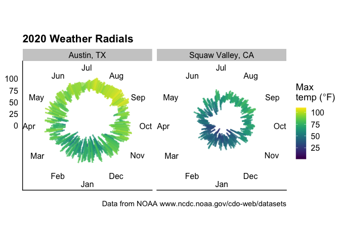
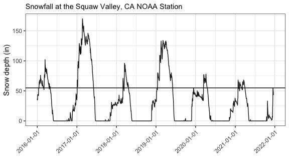

# R-weather

RStudio: 

## About

This repo was made from an [R-Binder template](https://github.com/binder-examples/r).
 
The weather data collected from NOAA using https://www.ncdc.noaa.gov/cdo-web/search and are stored in the **data** directory. 

The R scripts are stored in the **R** directory. An R project was created so that all paths work regardless of what computer is being used. 

All images used or created by the script are stored in the **images** subdirectory.  Here are a few of my favorites.

## [radials](https://github.com/raynamharris/r-weather/blob/master/R/weather-radials.md) 

## [ggridges](https://github.com/raynamharris/r-weather/blob/master/R/weather-ggridges.md)
